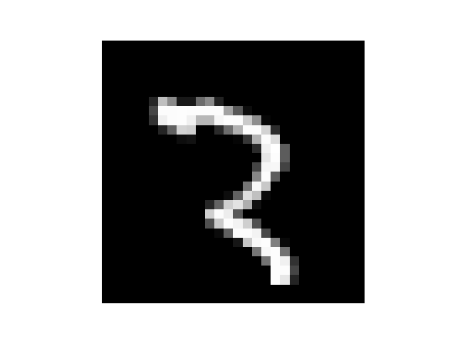

# Mnist

La idea de este proyecto sera alcanzar la mejor precision posible resolviendo el problema provisto por el dataset de keras `keras.datasets.mnist`.

Este problema ya fue resuelto por nosotros en un  [ejercicio pasado](https://github.com/PySanti/FirstKerasPractice) donde la mejor precision para el conjunto de test fue del 97%. En este ejercicio buscaremos mejorar aun mas dichos resultados utilizando `hypertunning` y tecnicas de regularizacion como `l2` y `dropout`.


## Preprocesamiento

Primeramente, visualizando el conjunto de datos:

```
Conjunto de entrenamiento
(60000, 28, 28)
(60000,)

Conjunto de test
(10000, 28, 28)
(10000,)
```

El conjunto de train tiene 60.000 registros de vectores de 28x28 y un target representado por un entero.

Se supone que cada vector de 28x28 representa a una imagen que contiene un numero escrito a mano en escala de grises, vamos a verlo.

Utilizando el siguiente codigo:

```

# utils/show_image.py

import matplotlib.pyplot as plt

def show_image(imagen):
    """
    Muestra una imagen en escala de grises de 28x28 píxeles usando Matplotlib.
    
    Parámetros:
    imagen -- numpy array de forma (28, 28) con valores entre 0 y 255 (escala de grises)
    """
    plt.imshow(imagen, cmap='gray')  # 'gray' para escala de grises
    plt.axis('off')  # Oculta los ejes
    plt.show()


# main.py

from tensorflow import keras
from utils.show_image import show_image

(X_train, Y_train), (X_test, Y_test) = keras.datasets.mnist.load_data()

print("Conjunto de entrenamiento")
print(X_train.shape)
print(Y_train.shape)

print("Conjunto de test")
print(X_test.shape)
print(Y_test.shape)

show_image(X_train[500])
print(f'Target de la imagen mostrada : {Y_train[500]}')


```

Terminal :

```
Conjunto de entrenamiento
(60000, 28, 28)
(60000,)
Conjunto de test
(10000, 28, 28)
(10000,)
Target de la imagen mostrada : 3
```

Imagen:



## Entrenamiento - Evaluacion
